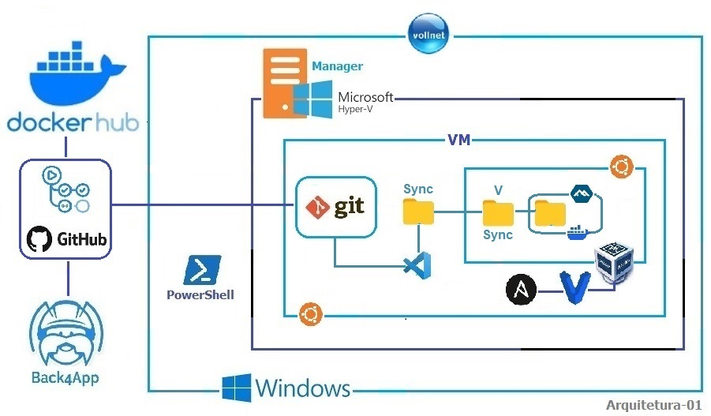

# VM-VOLL 

## General Information

    - DEVOPS Location    :
    - Project Name       :
    - Plataform Type     :
    - Production Provider:
    - Construction Date  : MM/DD/YYYY
    - Release Date       : MM/DD/YYYY

## HOST (VM && Bare Metal) 

### Resouces

    - SO Windows/Linux 
    - Hypervisors: Hyper-V, Virtualbox, VMware/ESXi
    - Chrome
    - VSCode

        * Extensions (See document in the Google Drive)

            > Portuguese (Brazil) Language for VSCode - by MS
            > GitLens - by GitKraken
            > Git History - by Don Jayamanne
            > Peacock for workspace color - by John Papa
            > Ansible - by Red Hat
            > Vagrant - by Baptist Benoist 
            > Javascript and TypeScript Nughtly - by MS
            > ES7+React/Redux/react-Native snippets - by dsznajder
            > Docker - by MS
            > Better Comments - by Aaron Bond
            > Bookmarks - by Alessandro Fragnani
            > Code Runner - by Jun Han
            > Console Ninja - by Wallaby.js
            > CMake - by twxs
            > CMake Tools - by MS
            > Doxygen Documentation Generator 
            > Dracula - by Dracula Theme
            > Live Server - by Ritwick Dey
            > YAML - by Red Hat
            > SQLite Viewer - by Florian Klampfer
            > Regex Snippets - by Monish Basaniwal
            > Prettier-Code Formatter - by Prettier
            > Material Icon Theme - by Philipp Kief

    - Virtualbox 7.0
    - Vagrant 2.4.1 && Plugin VBGuest
    - Ansible (PPA)
    - Git/GitHub/GitHub Actions
    - Provider Back4App

## VM VBox 

### Requirements 

    * Plataforms:

        - Javascript/TypeScript/NodeJS: NextJS/NestJS
        - Python && Django/Flask
        - Golang
        - Flutter/Dart

    * Docker && Docker Hub
       

## Installation 

## Operational 

## Observability

## Maintenance

## Troubleshooting

## FAQ

## Learnings
